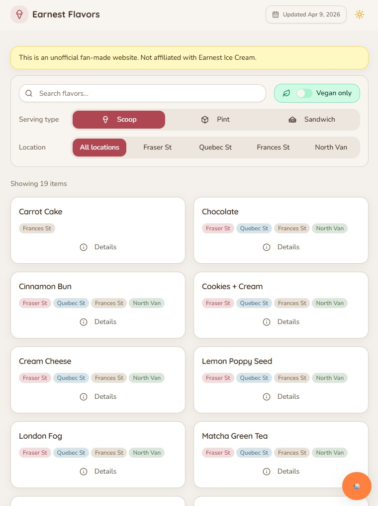
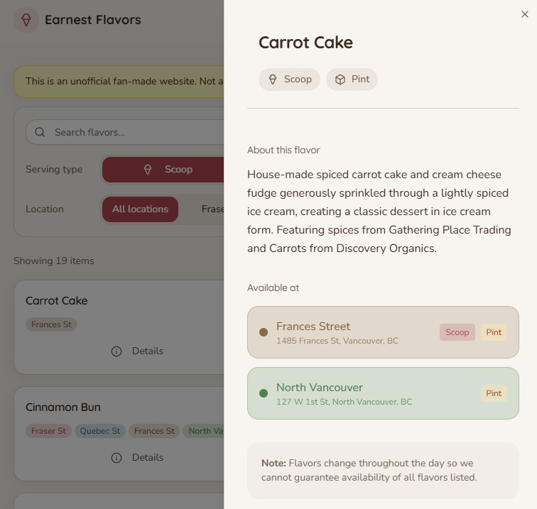

# [Earnest Flavors](https://kavankfc.github.io/earnest-flavours/)

An unofficial flavor explorer for Earnest Ice Cream scoop shops around Vancouver.

This little site shows which flavors are available as scoops, pints, and ice cream sandwiches across Fraser Street, Quebec Street, Frances Street, and North Vancouver. It is fan-made and not affiliated with Earnest Ice Cream.



## Why I Made This

I love ice cream, and I often want to see all the flavors available in the city without opening a separate page for every shop. Sometimes a favorite flavor is worth a longer trip, so I made this site to give fellow ice-cream lovers another way to decide where to go.



It is also my first vibe coding project on IDE. The scope felt just right: useful, small enough to understand end to end, and a good way to practice turning a simple everyday itch into a working app.

## Features

- Search flavors by name.
- Filter by serving type: scoop, pint, or sandwich.
- Filter by location.
- Toggle vegan-only flavors.
- Open flavor details with per-store availability.
- Light and dark mode.
- Automated scraper workflow for flavor data updates twice daily.

## Tech Stack

- React + TypeScript
- Vite
- Tailwind CSS
- shadcn/ui components
- Framer Motion
- Playwright scraper

## Development

```bash
npm install
npm run dev
```

Useful commands:

```bash
npm run test
npm run build
npm run preview
npm run scrape
npm run scrape:force
```

## Scraper Notes

`npm run scrape` checks the official Earnest site timestamp first and only refreshes local data when the source has changed.

`npm run scrape:force` skips that freshness check and always performs a full scrape.

Generated scrape outputs live in:

- `src/data/flavors.json`
- `src/data/flavor-descriptions.json`
- `src/data/metadata.json`

`src/data/flavor-descriptions.json` stores the latest known official flavor descriptions so they can be reused as fallbacks if a future description scrape misses a page.

Routine flavor updates should go through the scraper rather than manual edits.

## GitHub Actions

The GitHub Actions workflow runs twice daily at:

- `1:00 PM` Vancouver time
- `6:00 PM` Vancouver time

The scheduled workflow runs `npm run scrape`, so it will skip unnecessary updates when the official site timestamp has not changed.

## Disclaimer

Flavor availability can change throughout the day. Please check with your local Earnest shop for the most current offerings.
